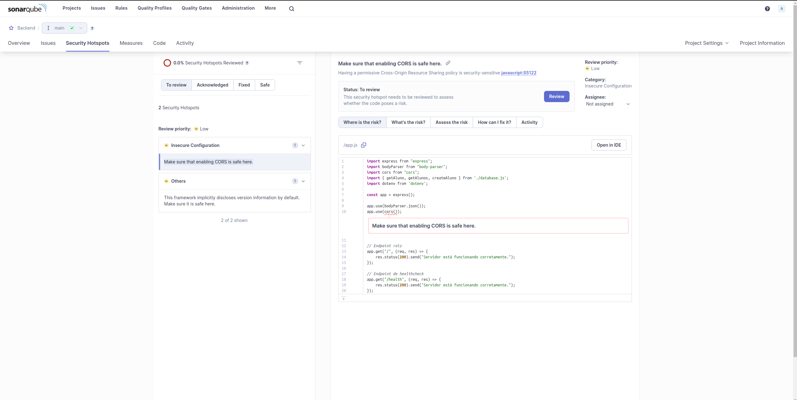
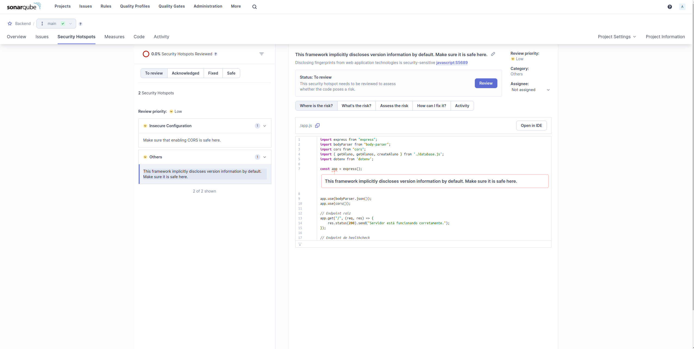
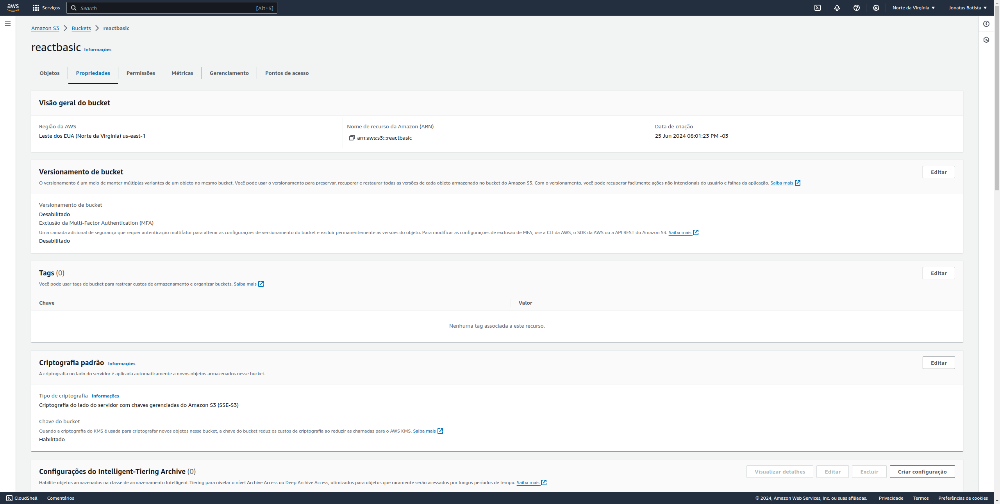
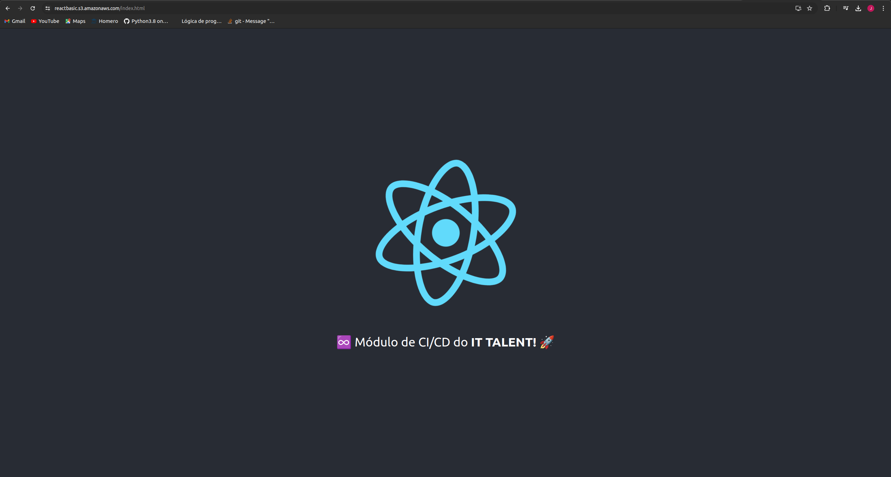

## SONARQUBE

Token gerado
```
sonar-scanner \
  -Dsonar.projectKey=Backend \
  -Dsonar.sources=. \
  -Dsonar.host.url=http://0.0.0.0:9000 \
  -Dsonar.token=sqp_16e4ec1db9ea23687708ecf4080f04dc292b0adb 
```





## AWS


## LINK
